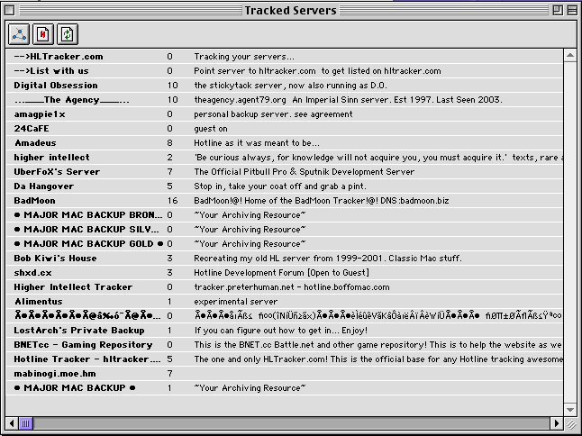
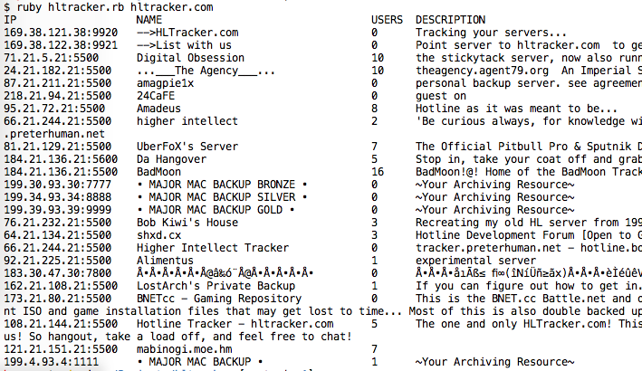

# hltracker.rb

## Simple command-line Hotline tracker interface

Connects to and retrieves the server list from a Hotline tracker.

When you see this in the Hotline Client:

You should see this with hltracker.rb:

